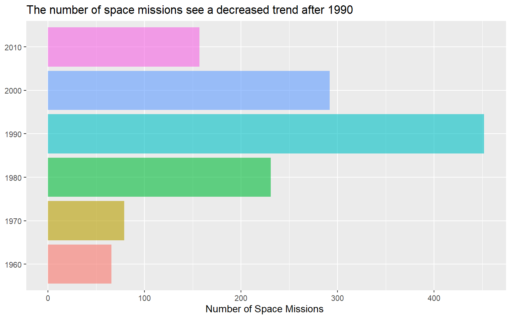
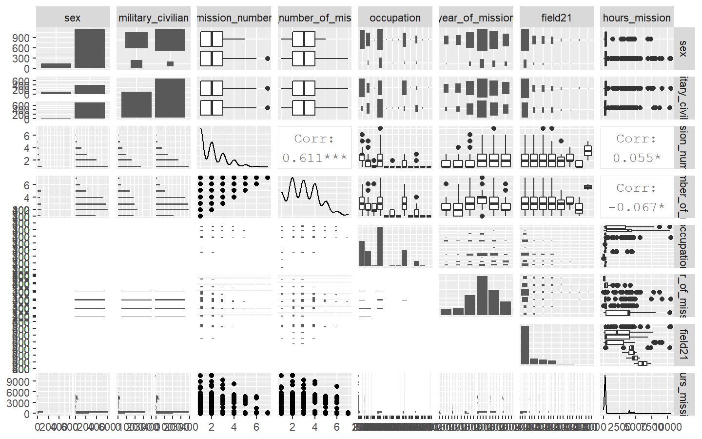

NOTE: These days I am following [Julia Silge](https://juliasilge.com/) for learning tidymodels framework better. This post is inspired from what I learned from her. You can find a screencast of her vidoes [here](https://www.youtube.com/channel/UCTTBgWyJl2HrrhQOOc710kA)

Space exploration is the use of astronomy and space technology to explore outer space. While the exploration of space is carried out mainly by astronomers with telescopes, its physical exploration though is conducted both by unmanned robotic space probes and human spaceflight. Space exploration, like its classical form astronomy, is one of the main sources for space science. More info [here](https://en.wikipedia.org/wiki/Space_exploration)

This database contains publically available information about all astronauts who participated in space missions before 15 January 2020 collected from NASA, Roscosmos, and fun-made websites. The provided information includes full astronaut name, sex, date of birth, nationality, military status, a title and year of a selection program, and information about each mission completed by a particular astronaut such as a year, ascend and descend shuttle names, mission and extravehicular activity (EVAs) durations. More info [here](https://github.com/rfordatascience/tidytuesday/tree/master/data/2020/2020-07-14)

In following analysis, we will try to find out if there is a relationship between the information available about the astronauts, space mission and the duration of the space mission. Can we create a model that can help us in predicting the duration of  a space mission by the information available about astronauts and space flight. Primarily we are trying to predict a continuous variable, hence we will use regression. More specifically we will use bagged trees using tidymodels workflow. We will create two models and will compare their performance. 
Let's get started..!

Lets load the data to see what we have here...

``` r
ttload <- tidytuesdayR::tt_load(x = "2020-07-14")
astranauts <- ttload$astronauts
```

### Some EDA
We will perform EDA to see if we can find some important relationships between various predictors and outcome. We will also try to find out some of the predictors that seem important for this purpose.


Chang-Diaz, Franklin R. and Ross, Jerry L. have done the most number of missions in the history. Both have been to space 7 times. Both belong to US. Following table sows top 10 astronauts with most number of trips

``` r
astranauts %>% 
    select(name, nationality, sex, hours_mission, total_hrs_sum) %>% 
    count(nationality, name, sex, sort = T) %>% 
    head(10) %>% 
    knitr::kable()
```

| nationality    | name                     | sex  | n |
| :------------- | :----------------------- | :--- | -: |
| U.S.           | Chang-Diaz, Franklin R.  | male | 7 |
| U.S.           | Ross, Jerry L.           | male | 7 |
| U.S.           | Brown, Curtis L., Jr.    | male | 6 |
| U.S.           | Foale, C. Michael        | male | 6 |
| U.S.           | Musgrave, Franklin Story | male | 6 |
| U.S.           | Wetherbee, James D.      | male | 6 |
| U.S.           | Young, John W.           | male | 6 |
| U.S.S.R/Russia | Krikalev, Sergei         | male | 6 |
| U.S.S.R/Russia | Malenchenko, Yuri        | male | 6 |
| U.S.           | Blaha, John E.           | male | 5 |

There are 40 countries that have been to space at least once. US tops the lists with 854 missions, Russia has 273 mission so far. Following table sows top 10 countries with most number of space missions.

``` r
astranauts %>% 
    select(nationality) %>% 
    count(nationality, sort = T) %>% 
    head(10) %>% 
    knitr::kable()
```

| nationality    |   n |
| :------------- | --: |
| U.S.           | 854 |
| U.S.S.R/Russia | 273 |
| Japan          |  20 |
| Canada         |  18 |
| France         |  18 |
| Germany        |  16 |
| China          |  14 |
| Italy          |  13 |
| U.K./U.S.      |   6 |
| Australia      |   4 |

Let’s plot a visualization to see how duration of space mission has change over the decades.

``` r
astranauts %>% 
  mutate(year_of_mission = 10*(year_of_mission %/% 10)) %>% 
  mutate(year_of_mission = factor(year_of_mission)) %>% 
  select(year_of_mission, hours_mission) %>% 
  ggplot(aes(x = year_of_mission, y = hours_mission, color = year_of_mission)) +
  geom_boxplot(show.legend = F) +
  scale_y_log10() +
  ggtitle("The average number of hours spent in space missions have increased significantly after 2010",) +
  labs(x = NULL,
       y = "Duration of Mission in Hours ")
```


<!-- --> 

Interestingly, the duration of missions has increased over the decades and their is a significant jump in median duration after 2010, which generates a hypothesis here that year of mission can be a good predictor of duration of space mission. We will confirm this hypothesis later, let’s move further.

Similarly, We can plot a similar visualization for the number of space mission in each decade. It will be interesting to see.

``` r
astranauts %>% 
  mutate(year_of_mission = 10*(year_of_mission %/% 10)) %>% 
  mutate(year_of_mission = factor(year_of_mission)) %>% 
  count(year_of_mission) %>% 
  ggplot(aes(x = year_of_mission, y = n, fill = year_of_mission)) +
  geom_col(show.legend = F, alpha = 0.6) +
  ggtitle("The number of space missions see a decreased trend after 1990",) +
  labs(x = NULL,
       y = "Number of Space Missions ") +
  coord_flip()
```

<!-- -->

#### Lets do some more analysis to understand what can be a good predictor to predict mission duration

``` r
astranauts %>%
  select(
    sex,
    military_civilian,
    mission_number,
    total_number_of_missions,
    occupation,
    year_of_mission,
    field21,
    hours_mission
  ) %>%
  mutate(year_of_mission = 10 * (year_of_mission %/% 10)) %>% 
  mutate(year_of_mission = factor(year_of_mission)) %>% 
  mutate_if(is.character, factor) %>% 
  mutate(field21 = as.factor(field21)) %>% 
  GGally::ggpairs()
```

<!-- --> 

It seems that

  - Sex or military/civilian are not very strong predictors of mission
    duration.
  - Mission number and total number of mission show weak correlation
    with the outcome, hence they also don’t seem to be good predictors.
  - Occupation, year of mission and field 21 seem to be good predictors
    of the outcome.

These arre some good hypothesis to test, We will test them while building the model.

#### Let’s prepare the dataset to build the model

``` r
astronauts_df <- astranauts %>% 
  select(name, mission_title, hours_mission,
         sex, military_civilian, occupation, year_of_mission, in_orbit, mission_number, total_number_of_missions, field21) %>% 
  filter(hours_mission>0) %>% 
  mutate(hours_mission = log(hours_mission)) %>% 
  mutate(in_orbit = case_when(str_detect(in_orbit, "^Salyut") ~ "Salyut",
                              str_detect(in_orbit, "^STS") ~ "STS",
                              TRUE ~ in_orbit)) %>% 
  mutate(occupation = case_when(str_detect(occupation, "^flight") ~ "Flight engineer",
                                str_detect(occupation, "tourist") ~ "Space tourist",
                                str_detect(occupation, "pilot") ~ "Pilot",
                                TRUE ~ occupation)) %>% 
  mutate(occupation = str_to_title(occupation)) %>% 
  na.omit()
```

#### Lets build the model

We will create splits, make a recipe and then build the model Splits

``` r
astro_split <- astronauts_df %>% 
  initial_split(strata = hours_mission)
astro_train <- training(astro_split)
astro_test <- testing(astro_split)
```

Recipe

``` r
astro_recipe <- recipe(hours_mission~., data = astro_train) %>% 
  update_role(name, mission_title, new_role = "ID") %>% 
  step_other(in_orbit, occupation, threshold = 0.005) %>% 
  themis::step_upsample(sex) %>% 
  step_dummy(all_nominal(), -has_role("ID"))
```

Model Specs and a workflow to make things systematic and faster
We are creating two models

* Bagged Tree, we will use rpart engine for this model
* Bagged MARS, we will use earth engine for this model

For more info on these models, you may find [this](https://www.tidymodels.org/find/parsnip/) link useful. 

``` r
#install.packages("baguette")
library(baguette)

tree_spec <- bag_tree() %>% 
  set_engine(engine = "rpart", times = 25) %>% 
  set_mode(mode = "regression")


mars_spec <- bag_mars() %>% 
  set_engine(engine = "earth", times = 25) %>% 
  set_mode(mode = "regression")


astro_wf <- workflow() %>% 
  add_recipe(recipe = astro_recipe)

```

Let's fit the model to the training data

``` r
tree_fit <- astro_wf %>% 
  add_model(tree_spec) %>% 
  fit(astro_train)

mars_fit <- astro_wf %>% 
  add_model(mars_spec) %>% 
  fit(astro_train)
```

We will test the model on test data and check our predictions

``` r
test_rs <- astro_test %>% 
  bind_cols(predict(tree_fit, astro_test)) %>% 
  rename(.pred_tree = .pred) %>% 
  bind_cols(predict(mars_fit, astro_test)) %>% 
  rename(.pred_mars = .pred)
```

Let’s compare the results using some visualizations

Evaluation metrics for Bagged Tree Model

``` r
test_rs %>% 
  metrics(hours_mission, .pred_tree)
```

    ## # A tibble: 3 x 3
    ##   .metric .estimator .estimate
    ##   <chr>   <chr>          <dbl>
    ## 1 rmse    standard       0.666
    ## 2 rsq     standard       0.760
    ## 3 mae     standard       0.367


Evaluation metrics for Bagged MARS Model

``` r
test_rs %>% 
  metrics(hours_mission, .pred_mars)
```

    ## # A tibble: 3 x 3
    ##   .metric .estimator .estimate
    ##   <chr>   <chr>          <dbl>
    ## 1 rmse    standard       0.667
    ## 2 rsq     standard       0.764
    ## 3 mae     standard       0.403

Seeing the results, It seems that both the models perform quite similar. There is almost no difference in rmse and R-square. Although bagged tree shows slightly lower absoloute error. It is difficult to choose any one of these basis this performance. A wise step further from here is to spend more time in feature exploration both to improve the perfomance of the model and to be able to choose one model over other in terms of performance. Remember, modelling is an iterative approach.

Okay..! We did it..!!! In this post, we saw how we can use different techniues (read modelling techniques) for regression. We used tidyverse for data exploration, we created two different regression models using Bagging and MARS approach, we evaluated the performance of these two models.  I hope this helps. Thank you so much for reading. See you again in the next post..!!
