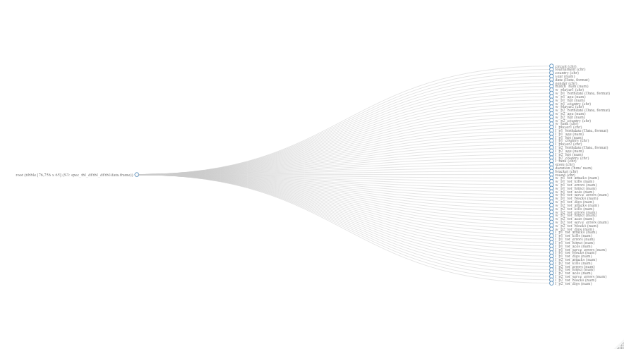

---
title: "A XGBoost Classification Model on Beach Volleyball in R"
subtitle: "An example of Classification using XGBoost and Tidymodels in R"
summary: "An example of Classification using XGBoost and Tidymodels in R"
tags: [rstats,tidymodels,xgboost, classification]
lastmod: false
date: 02-07-2020
authors: ["admin"]
share: false
categories: ["Machine Learning"]
image:
  placement: 1
  caption: "Image by H. B. from Pixabay"
  preview_only: false
---

NOTE: These days I am following [Julia Silge](https://juliasilge.com/) for learning tidymodels framework better. This post is inspired from what I learned from her. You can find a screencast of her vidoes [here](https://www.youtube.com/channel/UCTTBgWyJl2HrrhQOOc710kA)

[Beach volleyball](https://en.wikipedia.org/wiki/Beach_volleyball) is a team sport played by two teams of two players on a sand court divided by a net. As in indoor volleyball, the objective of the game is to send the ball over the net and to ground it on the opponent's side of the court, and to prevent the same effort by the opponent. Beach Volleyball matches are quite popular around the world. The game holds high popularity in countries such as US and Brazil. Beach volleyball most likely originated in 1915 on Waikiki Beach in Hawaii, while the modern two-player game originated in Santa Monica, California. It has been an Olympic sport since the 1996 Summer Olympics.

This dataset contains a huge record of beach volleyball matches. There are approximately 76500 rows in this dataset. Each row contains statistics of one match. Some of the important features available in the data are gender, stats related to winners and losers, match outcome, date, player details etc;

The objective of this modelling exercise is to predict the outcome of the match using information available. It is a binary classification problem and we have several ways to handle such problems, however, in this exercise we will use xgboost algorithm for classification. Let's get started.

### Let’s load the dataset

``` r
vb_matches <- readr::read_csv('https://raw.githubusercontent.com/rfordatascience/tidytuesday/master/data/2020/2020-05-19/vb_matches.csv', guess_max = 76000)

vb_matches %>% 
    head() %>% 
    knitr::kable()
```

| circuit | tournament       | country       | year | date       | gender | match\_num | w\_player1       | w\_p1\_birthdate | w\_p1\_age | w\_p1\_hgt | w\_p1\_country | w\_player2     | w\_p2\_birthdate | w\_p2\_age | w\_p2\_hgt | w\_p2\_country | w\_rank | l\_player1    | l\_p1\_birthdate | l\_p1\_age | l\_p1\_hgt | l\_p1\_country | l\_player2            | l\_p2\_birthdate | l\_p2\_age | l\_p2\_hgt | l\_p2\_country | l\_rank | score               | duration | bracket          | round   | w\_p1\_tot\_attacks | w\_p1\_tot\_kills | w\_p1\_tot\_errors | w\_p1\_tot\_hitpct | w\_p1\_tot\_aces | w\_p1\_tot\_serve\_errors | w\_p1\_tot\_blocks | w\_p1\_tot\_digs | w\_p2\_tot\_attacks | w\_p2\_tot\_kills | w\_p2\_tot\_errors | w\_p2\_tot\_hitpct | w\_p2\_tot\_aces | w\_p2\_tot\_serve\_errors | w\_p2\_tot\_blocks | w\_p2\_tot\_digs | l\_p1\_tot\_attacks | l\_p1\_tot\_kills | l\_p1\_tot\_errors | l\_p1\_tot\_hitpct | l\_p1\_tot\_aces | l\_p1\_tot\_serve\_errors | l\_p1\_tot\_blocks | l\_p1\_tot\_digs | l\_p2\_tot\_attacks | l\_p2\_tot\_kills | l\_p2\_tot\_errors | l\_p2\_tot\_hitpct | l\_p2\_tot\_aces | l\_p2\_tot\_serve\_errors | l\_p2\_tot\_blocks | l\_p2\_tot\_digs |
| :------ | :--------------- | :------------ | ---: | :--------- | :----- | ---------: | :--------------- | :--------------- | ---------: | ---------: | :------------- | :------------- | :--------------- | ---------: | ---------: | :------------- | :------ | :------------ | :--------------- | ---------: | ---------: | :------------- | :-------------------- | :--------------- | ---------: | ---------: | :------------- | :------ | :------------------ | :------- | :--------------- | :------ | ------------------: | ----------------: | -----------------: | -----------------: | ---------------: | ------------------------: | -----------------: | ---------------: | ------------------: | ----------------: | -----------------: | -----------------: | ---------------: | ------------------------: | -----------------: | ---------------: | ------------------: | ----------------: | -----------------: | -----------------: | ---------------: | ------------------------: | -----------------: | ---------------: | ------------------: | ----------------: | -----------------: | -----------------: | ---------------: | ------------------------: | -----------------: | ---------------: |
| AVP     | Huntington Beach | United States | 2002 | 2002-05-24 | M      |          1 | Kevin Wong       | 1972-09-12       |   29.69473 |         79 | United States  | Stein Metzger  | 1972-11-17       |   29.51403 |         75 | United States  | 1       | Chuck Moore   | 1973-08-18       |   28.76386 |         76 | United States  | Ed Ratledge           | 1976-12-16       |   25.43463 |         80 | United States  | 32      | 21-18, 21-12        | 00:33:00 | Winner’s Bracket | Round 1 |                  NA |                NA |                 NA |                 NA |                1 |                        NA |                  7 |               NA |                  NA |                NA |                 NA |                 NA |                2 |                        NA |                  0 |               NA |                  NA |                NA |                 NA |                 NA |                1 |                        NA |                  0 |               NA |                  NA |                NA |                 NA |                 NA |                0 |                        NA |                  1 |               NA |
| AVP     | Huntington Beach | United States | 2002 | 2002-05-24 | M      |          2 | Brad Torsone     | 1975-01-14       |   27.35661 |         78 | United States  | Casey Jennings | 1975-07-10       |   26.87201 |         75 | United States  | 16      | Mark Paaluhi  | 1971-03-08       |   31.21150 |         75 | United States  | Nick Hannemann        | 1972-01-12       |   30.36277 |         78 | United States  | 17      | 21-16, 17-21, 15-10 | 00:57:00 | Winner’s Bracket | Round 1 |                  NA |                NA |                 NA |                 NA |                0 |                        NA |                  4 |               NA |                  NA |                NA |                 NA |                 NA |                4 |                        NA |                  0 |               NA |                  NA |                NA |                 NA |                 NA |                0 |                        NA |                  2 |               NA |                  NA |                NA |                 NA |                 NA |                0 |                        NA |                  0 |               NA |
| AVP     | Huntington Beach | United States | 2002 | 2002-05-24 | M      |          3 | Eduardo Bacil    | 1971-03-11       |   31.20329 |         74 | Brazil         | Fred Souza     | 1972-05-13       |   30.02875 |         79 | Brazil         | 24      | Adam Jewell   | 1975-06-24       |   26.91581 |         77 | United States  | Collin Smith          | 1975-05-26       |   26.99521 |         76 | United States  | 9       | 21-18, 21-18        | 00:46:00 | Winner’s Bracket | Round 1 |                  NA |                NA |                 NA |                 NA |                0 |                        NA |                  2 |               NA |                  NA |                NA |                 NA |                 NA |                0 |                        NA |                  4 |               NA |                  NA |                NA |                 NA |                 NA |                1 |                        NA |                  1 |               NA |                  NA |                NA |                 NA |                 NA |                0 |                        NA |                  0 |               NA |
| AVP     | Huntington Beach | United States | 2002 | 2002-05-24 | M      |          4 | Brent Doble      | 1970-01-03       |   32.38604 |         78 | United States  | Karch Kiraly   | 1960-11-03       |   41.55236 |         74 | United States  | 8       | David Swatik  | 1973-02-14       |   29.27036 |         76 | United States  | Mike Mattarocci       | 1969-10-05       |   32.63244 |         80 | United States  | 25      | 21-16, 21-15        | 00:44:00 | Winner’s Bracket | Round 1 |                  NA |                NA |                 NA |                 NA |                0 |                        NA |                  3 |               NA |                  NA |                NA |                 NA |                 NA |                0 |                        NA |                  0 |               NA |                  NA |                NA |                 NA |                 NA |                0 |                        NA |                  2 |               NA |                  NA |                NA |                 NA |                 NA |                2 |                        NA |                  0 |               NA |
| AVP     | Huntington Beach | United States | 2002 | 2002-05-24 | M      |          5 | Albert Hannemann | 1970-05-04       |   32.05476 |         75 | United States  | Jeff Nygaard   | 1972-08-03       |   29.80424 |         80 | United States  | 5       | Adam Roberts  | 1976-01-25       |   26.32717 |         73 | United States  | Jim Walls             | 1978-03-26       |   24.16153 |         75 | United States  | 28      | 20-22, 23-21, 15-10 | 01:08:00 | Winner’s Bracket | Round 1 |                  NA |                NA |                 NA |                 NA |                1 |                        NA |                  0 |               NA |                  NA |                NA |                 NA |                 NA |                0 |                        NA |                  6 |               NA |                  NA |                NA |                 NA |                 NA |                0 |                        NA |                  0 |               NA |                  NA |                NA |                 NA |                 NA |                0 |                        NA |                  1 |               NA |
| AVP     | Huntington Beach | United States | 2002 | 2002-05-24 | M      |          6 | Jason Ring       | 1974-07-21       |   27.84120 |         75 | United States  | Paul Baxter    | 1972-02-01       |   30.30801 |         77 | United States  | 12      | Eli Fairfield | 1979-02-10       |   23.28268 |         NA | United States  | Juan Rodriguez Ibarra | 1969-05-30       |   32.98289 |         76 | Mexico         | 21      | 21-15, 16-21, 15-11 | 00:55:00 | Winner’s Bracket | Round 1 |                  NA |                NA |                 NA |                 NA |                0 |                        NA |                  0 |               NA |                  NA |                NA |                 NA |                 NA |                0 |                        NA |                  0 |               NA |                  NA |                NA |                 NA |                 NA |                0 |                        NA |                  0 |               NA |                  NA |                NA |                 NA |                 NA |                0 |                        NA |                  0 |               NA |

You will see guess_max argument in read_csv here. A default property of read_csv is to guess the type of column by looking at the data in these columns. Generally it tries to detect the type by looking at first few rows in each column. guess_max controls how many rows it should see before it assigns a type to the column.

### Let’s explore the dataset

We will use skim function to understand the data. As you can see we have 76756 rows with 65 variables. These are moderately large number of variables. We have character, numeric and date variables. We can see lot of missing data, hence it makes sense to explore missing data separately.

``` r
skimr::skim(vb_matches)
```

|                                                  |             |
| :----------------------------------------------- | :---------- |
| Name                                             | vb\_matches |
| Number of rows                                   | 76756       |
| Number of columns                                | 65          |
| \_\_\_\_\_\_\_\_\_\_\_\_\_\_\_\_\_\_\_\_\_\_\_   |             |
| Column type frequency:                           |             |
| character                                        | 17          |
| Date                                             | 5           |
| difftime                                         | 1           |
| numeric                                          | 42          |
| \_\_\_\_\_\_\_\_\_\_\_\_\_\_\_\_\_\_\_\_\_\_\_\_ |             |
| Group variables                                  | None        |

Data summary

**Variable type: character**

| skim\_variable | n\_missing | complete\_rate | min | max | empty | n\_unique | whitespace |
| :------------- | ---------: | -------------: | --: | --: | ----: | --------: | ---------: |
| circuit        |          0 |           1.00 |   3 |   4 |     0 |         2 |          0 |
| tournament     |          0 |           1.00 |   3 |  22 |     0 |       177 |          0 |
| country        |          0 |           1.00 |   4 |  22 |     0 |        51 |          0 |
| gender         |          0 |           1.00 |   1 |   1 |     0 |         2 |          0 |
| w\_player1     |          0 |           1.00 |   6 |  29 |     0 |      3388 |          0 |
| w\_p1\_country |         12 |           1.00 |   4 |  20 |     0 |        85 |          0 |
| w\_player2     |          0 |           1.00 |   5 |  30 |     0 |      3431 |          0 |
| w\_p2\_country |          5 |           1.00 |   4 |  20 |     0 |        87 |          0 |
| w\_rank        |        148 |           1.00 |   1 |   7 |     0 |       812 |          0 |
| l\_player1     |          0 |           1.00 |   5 |  29 |     0 |      5713 |          0 |
| l\_p1\_country |         18 |           1.00 |   4 |  20 |     0 |       109 |          0 |
| l\_player2     |          0 |           1.00 |   5 |  30 |     0 |      5689 |          0 |
| l\_p2\_country |         10 |           1.00 |   4 |  20 |     0 |       111 |          0 |
| l\_rank        |       1240 |           0.98 |   1 |   7 |     0 |       837 |          0 |
| score          |         22 |           1.00 |   4 |  25 |     0 |      6624 |          0 |
| bracket        |          0 |           1.00 |   6 |  21 |     0 |        36 |          0 |
| round          |       4939 |           0.94 |   7 |   8 |     0 |        10 |          0 |

**Variable type: Date**

| skim\_variable   | n\_missing | complete\_rate | min        | max        | median     | n\_unique |
| :--------------- | ---------: | -------------: | :--------- | :--------- | :--------- | --------: |
| date             |          0 |           1.00 | 2000-09-16 | 2019-08-29 | 2009-08-25 |       658 |
| w\_p1\_birthdate |        383 |           1.00 | 1953-06-13 | 2004-07-15 | 1981-10-30 |      2805 |
| w\_p2\_birthdate |        408 |           0.99 | 1952-10-11 | 2004-06-08 | 1981-10-15 |      2847 |
| l\_p1\_birthdate |       1059 |           0.99 | 1953-06-13 | 2004-12-01 | 1982-03-28 |      4236 |
| l\_p2\_birthdate |        959 |           0.99 | 1949-12-04 | 2004-08-12 | 1982-03-20 |      4282 |

**Variable type: difftime**

| skim\_variable | n\_missing | complete\_rate | min      | max       | median   | n\_unique |
| :------------- | ---------: | -------------: | :------- | :-------- | :------- | --------: |
| duration       |       2249 |           0.97 | 120 secs | 8040 secs | 00:42:00 |       108 |

**Variable type: numeric**

| skim\_variable            | n\_missing | complete\_rate |    mean |    sd |      p0 |     p25 |     p50 |     p75 |    p100 | hist  |
| :------------------------ | ---------: | -------------: | ------: | ----: | ------: | ------: | ------: | ------: | ------: | :---- |
| year                      |          0 |           1.00 | 2010.29 |  5.48 | 2000.00 | 2006.00 | 2009.00 | 2015.00 | 2019.00 | ▃▇▆▅▇ |
| match\_num                |          0 |           1.00 |   31.84 | 23.55 |    1.00 |   13.00 |   27.00 |   47.00 |  137.00 | ▇▅▂▁▁ |
| w\_p1\_age                |        383 |           1.00 |   28.73 |  5.05 |   13.55 |   25.01 |   28.34 |   32.05 |   59.86 | ▂▇▃▁▁ |
| w\_p1\_hgt                |       3966 |           0.95 |   73.71 |  3.64 |   63.00 |   71.00 |   74.00 |   76.00 |   85.00 | ▁▅▇▃▁ |
| w\_p2\_age                |        408 |           0.99 |   28.83 |  4.85 |   13.41 |   25.30 |   28.60 |   31.95 |   52.40 | ▁▇▆▁▁ |
| w\_p2\_hgt                |       4016 |           0.95 |   73.73 |  3.69 |   61.00 |   71.00 |   74.00 |   76.00 |   85.00 | ▁▃▇▆▁ |
| l\_p1\_age                |       1059 |           0.99 |   28.34 |  5.26 |   13.23 |   24.54 |   27.94 |   31.68 |   60.86 | ▂▇▂▁▁ |
| l\_p1\_hgt                |       6988 |           0.91 |   73.40 |  3.62 |   61.00 |   71.00 |   73.00 |   76.00 |   85.00 | ▁▃▇▅▁ |
| l\_p2\_age                |        959 |           0.99 |   28.37 |  5.12 |   13.41 |   24.71 |   28.01 |   31.58 |   67.76 | ▂▇▁▁▁ |
| l\_p2\_hgt                |       6983 |           0.91 |   73.52 |  3.65 |   61.00 |   71.00 |   74.00 |   76.00 |   85.00 | ▁▃▇▅▁ |
| w\_p1\_tot\_attacks       |      62178 |           0.19 |   25.89 | 10.00 |    0.00 |   19.00 |   24.00 |   32.00 |  142.00 | ▇▅▁▁▁ |
| w\_p1\_tot\_kills         |      62178 |           0.19 |   14.73 |  5.34 |    0.00 |   11.00 |   14.00 |   18.00 |   40.00 | ▂▇▅▁▁ |
| w\_p1\_tot\_errors        |      62413 |           0.19 |    2.90 |  2.27 |    0.00 |    1.00 |    2.00 |    4.00 |   32.00 | ▇▁▁▁▁ |
| w\_p1\_tot\_hitpct        |      62185 |           0.19 |    0.48 |  0.23 |  \-0.70 |    0.38 |    0.48 |    0.58 |   20.00 | ▇▁▁▁▁ |
| w\_p1\_tot\_aces          |      60560 |           0.21 |    1.32 |  1.45 |    0.00 |    0.00 |    1.00 |    2.00 |   14.00 | ▇▂▁▁▁ |
| w\_p1\_tot\_serve\_errors |      62417 |           0.19 |    2.03 |  1.65 |    0.00 |    1.00 |    2.00 |    3.00 |   13.00 | ▇▃▁▁▁ |
| w\_p1\_tot\_blocks        |      60560 |           0.21 |    1.70 |  2.15 |    0.00 |    0.00 |    1.00 |    3.00 |   14.00 | ▇▂▁▁▁ |
| w\_p1\_tot\_digs          |      62178 |           0.19 |    8.35 |  5.48 |    0.00 |    4.00 |    8.00 |   12.00 |   46.00 | ▇▅▁▁▁ |
| w\_p2\_tot\_attacks       |      62174 |           0.19 |   26.11 | 10.09 |    0.00 |   19.00 |   25.00 |   32.00 |  124.00 | ▇▇▁▁▁ |
| w\_p2\_tot\_kills         |      62174 |           0.19 |   14.80 |  5.33 |    0.00 |   11.00 |   14.00 |   18.00 |   41.00 | ▂▇▅▁▁ |
| w\_p2\_tot\_errors        |      62413 |           0.19 |    2.92 |  2.29 |    0.00 |    1.00 |    2.00 |    4.00 |   34.00 | ▇▁▁▁▁ |
| w\_p2\_tot\_hitpct        |      62181 |           0.19 |    0.48 |  0.16 |  \-0.68 |    0.37 |    0.47 |    0.58 |    3.50 | ▁▇▁▁▁ |
| w\_p2\_tot\_aces          |      60556 |           0.21 |    1.19 |  1.36 |    0.00 |    0.00 |    1.00 |    2.00 |   10.00 | ▇▁▁▁▁ |
| w\_p2\_tot\_serve\_errors |      62413 |           0.19 |    1.93 |  1.62 |    0.00 |    1.00 |    2.00 |    3.00 |   13.00 | ▇▃▁▁▁ |
| w\_p2\_tot\_blocks        |      60556 |           0.21 |    1.69 |  2.19 |    0.00 |    0.00 |    1.00 |    3.00 |   16.00 | ▇▂▁▁▁ |
| w\_p2\_tot\_digs          |      62174 |           0.19 |    8.54 |  5.56 |    0.00 |    4.00 |    8.00 |   12.00 |   52.00 | ▇▃▁▁▁ |
| l\_p1\_tot\_attacks       |      62179 |           0.19 |   27.13 | 11.11 |    0.00 |   19.00 |   26.00 |   34.00 |  330.00 | ▇▁▁▁▁ |
| l\_p1\_tot\_kills         |      62179 |           0.19 |   12.77 |  5.76 |    0.00 |    9.00 |   12.00 |   16.00 |   41.00 | ▃▇▃▁▁ |
| l\_p1\_tot\_errors        |      62413 |           0.19 |    4.38 |  2.76 |    0.00 |    2.00 |    4.00 |    6.00 |   30.00 | ▇▂▁▁▁ |
| l\_p1\_tot\_hitpct        |      62189 |           0.19 |    0.31 |  0.18 |  \-0.80 |    0.21 |    0.32 |    0.42 |    4.25 | ▃▇▁▁▁ |
| l\_p1\_tot\_aces          |      60561 |           0.21 |    0.78 |  1.04 |    0.00 |    0.00 |    0.00 |    1.00 |    9.00 | ▇▂▁▁▁ |
| l\_p1\_tot\_serve\_errors |      62418 |           0.19 |    2.10 |  1.66 |    0.00 |    1.00 |    2.00 |    3.00 |   12.00 | ▇▃▁▁▁ |
| l\_p1\_tot\_blocks        |      60561 |           0.21 |    1.00 |  1.53 |    0.00 |    0.00 |    0.00 |    2.00 |   14.00 | ▇▁▁▁▁ |
| l\_p1\_tot\_digs          |      62179 |           0.19 |    7.19 |  5.17 |    0.00 |    3.00 |    6.00 |   10.00 |   51.00 | ▇▂▁▁▁ |
| l\_p2\_tot\_attacks       |      62178 |           0.19 |   26.68 | 10.81 |  \-6.00 |   19.00 |   26.00 |   33.00 |  128.00 | ▃▇▁▁▁ |
| l\_p2\_tot\_kills         |      62178 |           0.19 |   12.57 |  5.66 |    0.00 |    8.00 |   12.00 |   16.00 |   42.00 | ▃▇▃▁▁ |
| l\_p2\_tot\_errors        |      62413 |           0.19 |    4.32 |  2.71 |    0.00 |    2.00 |    4.00 |    6.00 |   28.00 | ▇▃▁▁▁ |
| l\_p2\_tot\_hitpct        |      62189 |           0.19 |    0.31 |  0.18 |  \-0.67 |    0.21 |    0.32 |    0.42 |    3.50 | ▂▇▁▁▁ |
| l\_p2\_tot\_aces          |      60560 |           0.21 |    0.78 |  1.06 |    0.00 |    0.00 |    0.00 |    1.00 |   11.00 | ▇▁▁▁▁ |
| l\_p2\_tot\_serve\_errors |      62417 |           0.19 |    2.05 |  1.66 |    0.00 |    1.00 |    2.00 |    3.00 |   15.00 | ▇▂▁▁▁ |
| l\_p2\_tot\_blocks        |      60560 |           0.21 |    1.06 |  1.56 |    0.00 |    0.00 |    0.00 |    2.00 |   13.00 | ▇▁▁▁▁ |
| l\_p2\_tot\_digs          |      62178 |           0.19 |    7.14 |  5.18 |    0.00 |    3.00 |    6.00 |   10.00 |   41.00 | ▇▃▁▁▁ |

We will explore the missing data now. We can use dataexplorer package to explore missing data as it provides some very useful visual summaries of the dataset.

``` r
DataExplorer::plot_str(vb_matches)
DataExplorer::plot_intro(vb_matches)
```



``` r
DataExplorer::plot_missing(vb_matches)
```


### Prepare data

We will do some transformations to make the data modelling ready. 
* We should merge player 1 and player 2 stats for both winners and losers and treat it as one column.
* We should use gender, circuit and year variables and drop rest of the columns for now

``` r
vb_parsed <- vb_matches %>%
    transmute(
        circuit,
        gender,
        year,
        w_attacks = w_p1_tot_attacks + w_p2_tot_attacks,
        w_kills = w_p1_tot_kills + w_p2_tot_kills,
        w_errors = w_p1_tot_errors + w_p2_tot_errors,
        w_aces = w_p1_tot_aces + w_p2_tot_aces,
        w_serve_errors = w_p1_tot_serve_errors + w_p2_tot_serve_errors,
        w_blocks = w_p1_tot_blocks + w_p2_tot_blocks,
        w_digs = w_p1_tot_digs + w_p2_tot_digs,
        l_attacks = l_p1_tot_attacks + l_p2_tot_attacks,
        l_kills = l_p1_tot_kills + l_p2_tot_kills,
        l_errors = l_p1_tot_errors + l_p2_tot_errors,
        l_aces = l_p1_tot_aces + l_p2_tot_aces,
        l_serve_errors = l_p1_tot_serve_errors + l_p2_tot_serve_errors,
        l_blocks = l_p1_tot_blocks + l_p2_tot_blocks,
        l_digs = l_p1_tot_digs + l_p2_tot_digs
    ) %>%
    na.omit()

winners <- vb_parsed %>% 
    select(circuit,
           gender,
           year,
           w_attacks:w_digs) %>% 
    rename_with(~str_remove_all(., "w_")) %>% 
    mutate(win = "win")

losers <- vb_parsed %>% 
    select(circuit,
           gender,
           year,
           l_attacks:l_digs) %>% 
    rename_with(~str_remove_all(., "l_")) %>% 
    mutate(win = "lose")

vb_df <- bind_rows(winners, losers) %>% 
    mutate_if(is.character, factor)

vb_df %>% 
    head() %>% 
    knitr::kable()
```

| circuit | gender | year | attacks | kills | errors | aces | serve\_errors | blocks | digs | win |
| :------ | :----- | ---: | ------: | ----: | -----: | ---: | ------------: | -----: | ---: | :-- |
| AVP     | M      | 2004 |      45 |    24 |      7 |    0 |             2 |      5 |   11 | win |
| AVP     | M      | 2004 |      71 |    31 |     16 |    3 |             8 |      7 |   21 | win |
| AVP     | M      | 2004 |      43 |    26 |      5 |    2 |             4 |      7 |   10 | win |
| AVP     | M      | 2004 |      42 |    32 |      5 |    2 |             3 |      7 |    7 | win |
| AVP     | M      | 2004 |      44 |    31 |      1 |    0 |             5 |      6 |   15 | win |
| AVP     | M      | 2004 |      55 |    31 |      6 |    0 |             4 |      8 |   22 | win |

Finally, we have created two separate data frames for winner and losers and then combined them by binding rows. Our final dataframe is ready. We can use it for modelling now. It contains 28664 rows and 11 columns. Rows are lesser than the raw data as we have straight away removed missing values. Sample size is still large enough to perform modelling. 

### Lets perform some EDA

We can plot some visualizations to check if these variables are good enough to differentiate the two classes i.e. win and loss. 

``` r
vb_df %>%
  pivot_longer(attacks:digs, names_to = "stat", values_to = "value") %>%
  ggplot(aes(
    x = gender,
    y = value,
    fill = win,
    color = win
  )) +
  geom_boxplot(alpha = 0.5) +
  facet_wrap( ~ stat, scales = "free_y", nrow = 2) +
  labs(x = NULL,
       fill = NULL,
       color = NULL)
```

<!-- -->

``` r
vb_df %>%
  pivot_longer(attacks:digs, names_to = "stat", values_to = "value") %>%
  ggplot(aes(
    x = circuit,
    y = value,
    fill = win,
    color = win
  )) +
  geom_boxplot(alpha = 0.5) +
  facet_wrap( ~ stat, scales = "free_y", nrow = 2) +
  labs(x = NULL,
       fill = NULL,
       color = NULL)
```

<!-- -->

These boxplots confirm that some of the features such as kills, errors, attacks are good predictors of outcome class. It is evident visually, So we will confirm our hypothesis while modelling.

### Build a model
As we are going to build a xgboost model so there is no separate need to pre-process the data. The algorithm takes care of nominal variables by dummifying them and normalizing the numerical variables. Hence we will do following things now in order to build the model

* We will create a split
* We will create model specs
* We will create grid for model tuning
* We will create a workflow for systematic process flow
* We will also create resamples using k-fold cross validation for effective tuning.
* Finally we will train the model

### Data Split
``` r
set.seed(123)
vb_split <- vb_df %>% 
  initial_split(strata = win)

vb_train <- training(vb_split)
vb_test <- testing(vb_split)
vb_split
```

    ## <Analysis/Assess/Total>
    ## <21498/7166/28664>

### Model Spec
In arguments we have defined parameters but have not specified any value as we are going to find the best hyper parameters by tuning the model.

``` r
xgb_spec <- boost_tree(
  trees = 1000,
  tree_depth = tune(),
  min_n = tune(),
  loss_reduction = tune(),
  sample_size = tune(),
  mtry = tune(),
  learn_rate = tune()
) %>%
  set_engine(engine = "xgboost") %>%
  set_mode(mode = "classification")

xgb_spec
```

    ## Boosted Tree Model Specification (classification)
    ## 
    ## Main Arguments:
    ##   mtry = tune()
    ##   trees = 1000
    ##   min_n = tune()
    ##   tree_depth = tune()
    ##   learn_rate = tune()
    ##   loss_reduction = tune()
    ##   sample_size = tune()
    ## 
    ## Computational engine: xgboost

### Tuning Grid using Hypercube

``` r
xgb_grid <- grid_latin_hypercube(tree_depth(),
                     min_n(),
                     loss_reduction(),
                     sample_size = sample_prop(),
                     finalize(mtry(),vb_train),
                     learn_rate(),
                     size = 20)
xgb_grid
```

    ## # A tibble: 20 x 6
    ##    tree_depth min_n loss_reduction sample_size  mtry learn_rate
    ##         <int> <int>          <dbl>       <dbl> <int>      <dbl>
    ##  1          6     7       1.85e- 5       0.125    10   2.34e- 4
    ##  2          7    25       5.43e- 7       0.922     3   1.45e- 5
    ##  3         13    19       9.87e- 2       0.537     4   4.11e- 7
    ##  4         11    39       2.57e- 1       0.303     7   6.58e- 3
    ##  5         13    11       9.46e- 3       0.561     5   6.87e- 6
    ##  6          9    30       2.34e+ 1       0.354     4   4.37e- 3
    ##  7         15     6       7.46e+ 0       0.617     7   1.35e- 4
    ##  8          4    36       4.93e- 4       0.663     5   5.36e- 5
    ##  9          9    27       3.31e- 6       0.170     9   1.23e- 3
    ## 10          2    15       9.23e- 9       0.979     1   1.56e- 6
    ## 11         10    33       1.12e- 7       0.859     8   1.19e- 8
    ## 12          5    19       2.91e- 9       0.449     2   2.69e- 8
    ## 13         12    37       1.14e+ 0       0.897    11   1.81e-10
    ## 14          2     3       2.33e- 2       0.747     3   1.22e- 7
    ## 15         10    21       4.50e-10       0.817     2   1.15e- 9
    ## 16          1     9       3.99e- 8       0.190     8   3.02e- 7
    ## 17          4    13       1.94e- 3       0.468     6   2.89e- 9
    ## 18          5    31       1.67e- 4       0.379     9   4.96e-10
    ## 19          8    15       1.02e-10       0.713    10   4.86e- 2
    ## 20         14    28       4.07e- 6       0.274     6   1.62e- 2

### Model Workflow
``` r
xgb_wf <- workflow() %>%
  add_formula(win ~ .) %>%
  add_model(xgb_spec)
xgb_wf
```

    ## == Workflow ========================================================================================================
    ## Preprocessor: Formula
    ## Model: boost_tree()
    ## 
    ## -- Preprocessor ----------------------------------------------------------------------------------------------------
    ## win ~ .
    ## 
    ## -- Model -----------------------------------------------------------------------------------------------------------
    ## Boosted Tree Model Specification (classification)
    ## 
    ## Main Arguments:
    ##   mtry = tune()
    ##   trees = 1000
    ##   min_n = tune()
    ##   tree_depth = tune()
    ##   learn_rate = tune()
    ##   loss_reduction = tune()
    ##   sample_size = tune()
    ## 
    ## Computational engine: xgboost

### k-fold Cross Validation for resampling

``` r
set.seed(123)
vb_folds <- vfold_cv(vb_train, strata = win)
vb_folds
```

    ## #  10-fold cross-validation using stratification 
    ## # A tibble: 10 x 2
    ##    splits               id    
    ##    <list>               <chr> 
    ##  1 <split [19.3K/2.1K]> Fold01
    ##  2 <split [19.3K/2.1K]> Fold02
    ##  3 <split [19.3K/2.1K]> Fold03
    ##  4 <split [19.3K/2.1K]> Fold04
    ##  5 <split [19.3K/2.1K]> Fold05
    ##  6 <split [19.3K/2.1K]> Fold06
    ##  7 <split [19.3K/2.1K]> Fold07
    ##  8 <split [19.3K/2.1K]> Fold08
    ##  9 <split [19.3K/2.1K]> Fold09
    ## 10 <split [19.4K/2.1K]> Fold10

### Setting Parallel environment for faster processing and fitting the model
XGBoost is a computationally intensive algorithm, hence it is always better to use parallel processing to save on some time. Argument verbose = T is optional , It simply shows the progress of model fitting in R console so you can see the progress of model convergence.

``` r
doParallel::registerDoParallel()
set.seed(234)
xgb_res <- tune_grid(
  xgb_wf,
  resamples = vb_folds,
  grid = xgb_grid,
  control = control_grid(save_pred = T, verbose = T)
)
```

### Explore the results
Lets see what are the hyperparameters that yield best AUC value.

``` r
best_auc <- xgb_res %>% 
  show_best(metric = "roc_auc")
best_auc
```

    ## # A tibble: 5 x 11
    ##    mtry min_n tree_depth learn_rate loss_reduction sample_size .metric
    ##   <int> <int>      <int>      <dbl>          <dbl>       <dbl> <chr>  
    ## 1     6    28         14 0.0162     0.00000407           0.274 roc_auc
    ## 2     7    39         11 0.00658    0.257                0.303 roc_auc
    ## 3    10    15          8 0.0486     0.000000000102       0.713 roc_auc
    ## 4     7     6         15 0.000135   7.46                 0.617 roc_auc
    ## 5     5    11         13 0.00000687 0.00946              0.561 roc_auc
    ## # ... with 4 more variables: .estimator <chr>, mean <dbl>, n <int>,
    ## #   std_err <dbl>

Similarly, Lets see what are the hyperparameters that yield best Accuracy.

``` r
best_acc <- xgb_res %>% 
  show_best(metric = "accuracy")
best_acc
```

    ## # A tibble: 5 x 11
    ##    mtry min_n tree_depth learn_rate loss_reduction sample_size .metric
    ##   <int> <int>      <int>      <dbl>          <dbl>       <dbl> <chr>  
    ## 1     6    28         14    1.62e-2 0.00000407           0.274 accura~
    ## 2     7    39         11    6.58e-3 0.257                0.303 accura~
    ## 3    10    15          8    4.86e-2 0.000000000102       0.713 accura~
    ## 4     5    11         13    6.87e-6 0.00946              0.561 accura~
    ## 5     4    19         13    4.11e-7 0.0987               0.537 accura~
    ## # ... with 4 more variables: .estimator <chr>, mean <dbl>, n <int>,
    ## #   std_err <dbl>

### Visualize the results
We can visually see how average performance of the model in terms of AUC changed for different values of model parameters during convergence. 

``` r
xgb_res %>%
  collect_metrics() %>%
  filter(.metric == "roc_auc") %>%
  select(mean, mtry:sample_size) %>%
  pivot_longer(mtry:sample_size,
               names_to = "parameter",
               values_to = "value") %>%
  ggplot(aes(value, mean, color = parameter), alpha = 0.5) +
  geom_line(size = 1, show.legend = F) +
  facet_wrap( ~ parameter, scales = "free_x") 
```

<!-- -->

``` r
xgb_res %>%
  collect_metrics() %>%
  transmute(trial = row_number(), .metric, mean) %>%
  ggplot(aes(trial, mean, color = .metric), alpha = 0.5) +
  geom_line(size = 1, show.legend = T) +
  geom_point(size = 2, show.legend = T) +
  labs(x = "Trials",
       y = "Mean Parametric Value",
       title = "Accuracy & AUC trends for different trials")  
```

<!-- -->

### Select best hyper parameter
We will select the best hyperparameter based on best roc_auc and finalize the workflow

``` r
best_auc <- xgb_res %>% 
  select_best(metric = "roc_auc")

final_xgb <- xgb_wf %>% 
  finalize_workflow(best_auc)

final_xgb
```

    ## == Workflow ========================================================================================================
    ## Preprocessor: Formula
    ## Model: boost_tree()
    ## 
    ## -- Preprocessor ----------------------------------------------------------------------------------------------------
    ## win ~ .
    ## 
    ## -- Model -----------------------------------------------------------------------------------------------------------
    ## Boosted Tree Model Specification (classification)
    ## 
    ## Main Arguments:
    ##   mtry = 6
    ##   trees = 1000
    ##   min_n = 28
    ##   tree_depth = 14
    ##   learn_rate = 0.016199890154566
    ##   loss_reduction = 4.07341934175922e-06
    ##   sample_size = 0.27370679514017
    ## 
    ## Computational engine: xgboost

### Variable Importance Metrics
It will be interesting to see which variable according the model are of high importance in predicting the outcome.

``` r
library(vip)

final_xgb %>% 
  fit(data = vb_train) %>% 
  pull_workflow_fit() %>% 
  vip(geom = "point")
```

<!-- -->

VIP plot suggests that kills, errors, attacks, blocks, digs are the most important variable. If you remember this was our hypothesis before building the model. Hence it confirms our hypothesis. 

### Training and Testing Final Model
Finally, we will train our final model again on the whole training data and will test on test data. Final Model Performance is as follows:

``` r
final_res <- final_xgb %>% 
  last_fit(vb_split)

final_metric <- final_res %>%
  collect_metrics()

final_metric    
```

    ## # A tibble: 2 x 3
    ##   .metric  .estimator .estimate
    ##   <chr>    <chr>          <dbl>
    ## 1 accuracy binary         0.842
    ## 2 roc_auc  binary         0.927

Final model performs more or less similar to training which indicates there is no overfitting and we are good to go further.

### Confusion Metric

``` r
final_conf_mat <- final_res %>% 
  collect_predictions() %>% 
  conf_mat(win, .pred_class)

final_conf_mat
```

    ##           Truth
    ## Prediction lose  win
    ##       lose 2967  513
    ##       win   616 3070

### ROC AUC Curve Plot

``` r
final_res %>% 
  collect_predictions() %>% 
  roc_curve(win, .pred_win) %>% 
  autoplot()
```

<!-- -->

### Save our data and objects
Although this is not a necessary step in modelling but it is good practice to save the .Robjects as it saves time when we load the model next time. We simply can load all the objects back again rather than creating them again in next session.

``` r
save.image(file = "allobjects.RData")
```

We did it..!! We created a XGBoost Model to predict win in a beach volleyball match. We tuned hyperparameters using a standard tidymodels workflow and measured the performance of the model which is pretty good in this case. I hope this helps. Thank you so much for reading. See you again in the next post..!!
