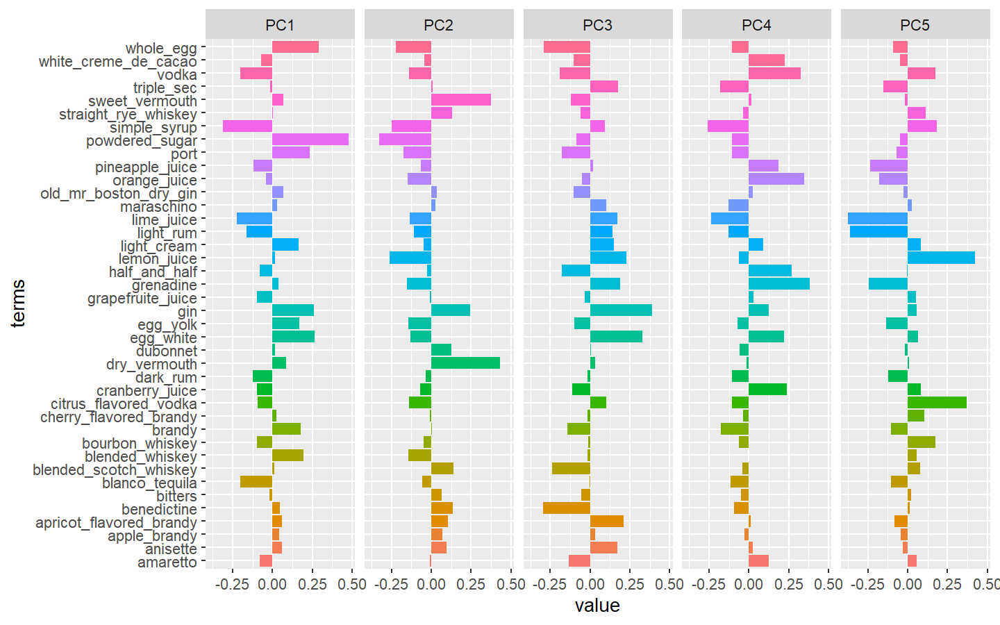
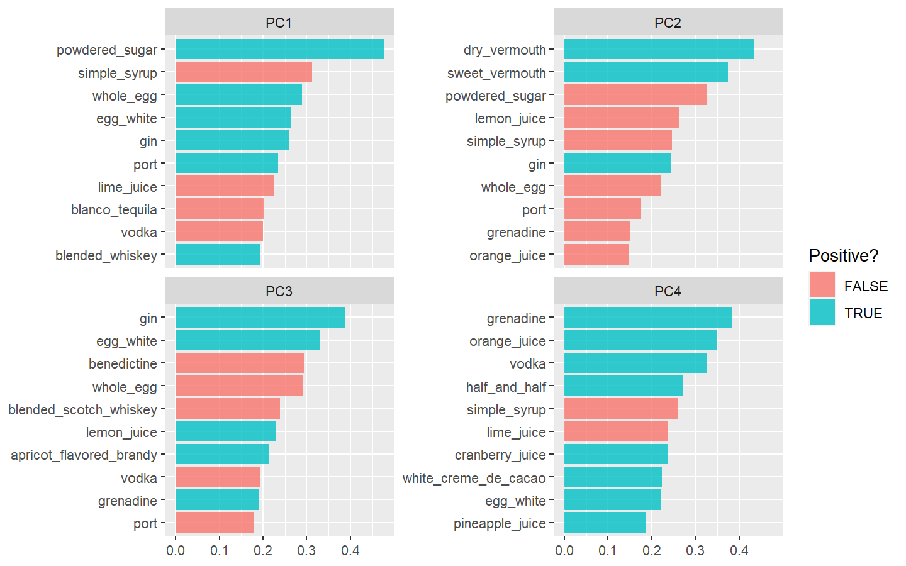
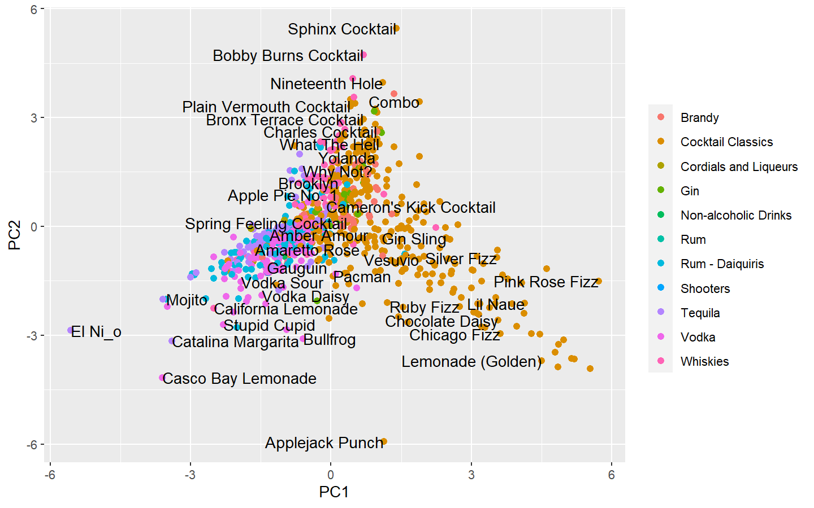

NOTE: These days I am following [Julia Silge](https://juliasilge.com/) for learning tidymodels framework better. This post is inspired from what I learned from her. You can find a screencast of her vidoes [here](https://www.youtube.com/channel/UCTTBgWyJl2HrrhQOOc710kA)

Drinking fancy cocktails always puts us in the mood to have a good time, like crafting edible garnishes and floral beverages. But sometimes we don't feel like having to mix up an elaborate drink (even if it's supposedly healthier than our usual tipple) just to quench our cocktail craving. Luckily, mixology doesn't have to be complicated. Here we will showcase a method to find out what ingredients in a cocktail go together and what should not be mixed using dimensionality reduction techniques. We will demonstrate two most popular and powerful methods:
* [Principal Component Analysis](https://en.wikipedia.org/wiki/Principal_component_analysis) (also knowns as PCA)
* [Uniform Monifold Approximation and Projection](https://umap-learn.readthedocs.io/en/latest/) ( also known as UMAP)


Sounds fun..! Let's get started.


### Load the data
Our data comes from the [tidy tuesday dataset](https://github.com/rfordatascience/tidytuesday) which is a weekly data project aimed at the R ecosystem from the R4DS online learning community.

``` r
boston_cocktails <- readr::read_csv("https://raw.githubusercontent.com/rfordatascience/tidytuesday/master/data/2020/2020-05-26/boston_cocktails.csv")
boston_cocktails %>% head() %>% 
  knitr::kable()
```

| name            | category          | row\_id | ingredient\_number | ingredient          | measure  |
| :-------------- | :---------------- | ------: | -----------------: | :------------------ | :------- |
| Gauguin         | Cocktail Classics |       1 |                  1 | Light Rum           | 2 oz     |
| Gauguin         | Cocktail Classics |       1 |                  2 | Passion Fruit Syrup | 1 oz     |
| Gauguin         | Cocktail Classics |       1 |                  3 | Lemon Juice         | 1 oz     |
| Gauguin         | Cocktail Classics |       1 |                  4 | Lime Juice          | 1 oz     |
| Fort Lauderdale | Cocktail Classics |       2 |                  1 | Light Rum           | 1 1/2 oz |
| Fort Lauderdale | Cocktail Classics |       2 |                  2 | Sweet Vermouth      | 1/2 oz   |

We see 3643 observations with 6 variables, Let's explore it more to see if it needs further transformation.

### Data Transformation

``` r
cocktail_parsed <- boston_cocktails %>% 
    mutate(ingredient = str_to_lower(ingredient),
           ingredient = str_replace_all(ingredient, "-", " "),
           ingredient = str_remove(ingredient, " liqueur"),
           ingredient = case_when(str_detect(ingredient, "bitters") ~ "bitters",
                                  str_detect(ingredient, "orange") ~ "orange juice",
                                  str_detect(ingredient, "lemon") ~ "lemon juice",
                                  str_detect(ingredient, "lime") ~ "lime juice",
                                  str_detect(ingredient, "grapefruit") ~ "grapefruite juice",
                                  TRUE ~ ingredient),
           measure = case_when(str_detect(ingredient, "bitters") ~ str_replace(measure, "oz", "dash"),
                               TRUE ~ measure),
           measure = str_replace(measure, " ?1/2", ".5"),
           measure = str_replace(measure, " ?1/4", ".25"),
           measure = str_replace(measure, " ?3/4", ".75"),
           measure_number = parse_number(measure),
           measure_number = if_else(str_detect(measure, "dash$"), measure_number / 50, measure_number)) %>% 
    add_count(ingredient, sort = T) %>% 
    filter(n>15) %>% 
    select(-n) %>% 
    distinct(row_id, ingredient, .keep_all = T) %>% 
    na.omit()

cocktail_parsed %>%
    head() %>% 
    knitr::kable()
```

| name            | category              | row\_id | ingredient\_number | ingredient  | measure | measure\_number |
| :-------------- | :-------------------- | ------: | -----------------: | :---------- | :------ | --------------: |
| Gauguin         | Cocktail Classics     |       1 |                  3 | lemon juice | 1 oz    |            1.00 |
| John Collins    | Whiskies              |       6 |                  2 | lemon juice | 1 oz    |            1.00 |
| Amber Amour     | Cordials and Liqueurs |      10 |                  2 | lemon juice | .25 oz  |            0.25 |
| The Joe Lewis   | Whiskies              |      11 |                  4 | lemon juice | .5 oz   |            0.50 |
| Apple Pie No. 1 | Cocktail Classics     |      13 |                  5 | lemon juice | 1 oz    |            1.00 |
| Why Not?        | Cocktail Classics     |      16 |                  4 | lemon juice | 1 oz    |            1.00 |

We have done some clean up in the ingredient column and separated out the quantity from measure column and have created a separate variable called measure_number. This wrangling leaves us with 2546 rows and 7 columns.

Lets widen the dataset so that we can bring it in a form where dimensionality reduction can be applied.

``` r
cocktail_df <- cocktail_parsed %>% 
    select(-ingredient_number, -row_id, -measure) %>% 
    pivot_wider(names_from = ingredient, values_from = measure_number,
                values_fill = 0) %>% 
    janitor::clean_names() %>% 
    na.omit()

DataExplorer::introduce(cocktail_df)
```

    ## # A tibble: 1 x 9
    ##    rows columns discrete_columns continuous_colu~ all_missing_col~
    ##   <int>   <int>            <int>            <int>            <int>
    ## 1   937      42                2               40                0
    ## # ... with 4 more variables: total_missing_values <int>, complete_rows <int>,
    ## #   total_observations <int>, memory_usage <dbl>

Finally, we have our tidy dataframe ready for some modelling. We have 937 observations with total 42 different variables out of which 40 are continuous and 2 are discrete.
We will apply dimensionality reduction now.

## Principal Component Analysis (PCA)

We will start with PCA. To apply PCA, we will create a recipe in an unsupervised fashion without mentioning any outcome variable. We won't use name and category features, So their roles have been updated to "ID". Step_pca performs pca in R tidymodels framework.

``` r
pca_rec <- recipe(~., data = cocktail_df) %>% 
    update_role(name, category, new_role = "ID") %>% 
    step_normalize(all_predictors()) %>% 
    step_pca(all_predictors())

pca_prep <- prep(pca_rec)
pca_prep
```

    ## Data Recipe
    ## 
    ## Inputs:
    ## 
    ##       role #variables
    ##         ID          2
    ##  predictor         40
    ## 
    ## Training data contained 937 data points and no missing data.
    ## 
    ## Operations:
    ## 
    ## Centering and scaling for lemon_juice, lime_juice, gin, ... [trained]
    ## PCA extraction with lemon_juice, lime_juice, gin, ... [trained]

When we prep the recipe, it performs all the step transformations specified in our recipe. If we want to see the details we can use tidy() function to get a tabular summary.

``` r
tidied_pca <- tidy(pca_prep, 2)
tidied_pca
```

    ## # A tibble: 1,600 x 4
    ##    terms          value component id       
    ##    <chr>          <dbl> <chr>     <chr>    
    ##  1 lemon_juice   0.0167 PC1       pca_I3IqE
    ##  2 lime_juice   -0.224  PC1       pca_I3IqE
    ##  3 gin           0.260  PC1       pca_I3IqE
    ##  4 bitters      -0.0210 PC1       pca_I3IqE
    ##  5 orange_juice -0.0405 PC1       pca_I3IqE
    ##  6 simple_syrup -0.312  PC1       pca_I3IqE
    ##  7 vodka        -0.200  PC1       pca_I3IqE
    ##  8 light_rum    -0.163  PC1       pca_I3IqE
    ##  9 triple_sec   -0.0137 PC1       pca_I3IqE
    ## 10 dry_vermouth  0.0874 PC1       pca_I3IqE
    ## # ... with 1,590 more rows

### Visualise Principal Components

``` r
tidied_pca %>% 
    filter(component %in% paste0("PC", 1:5)) %>% 
    mutate(component = fct_inorder(component)) %>% 
    ggplot(aes(value, terms, fill = terms), alpha = 0.5) +
    geom_col(show.legend = F) +
    facet_wrap(~ component, nrow = 1)
```

<!-- -->

``` r
library(tidytext)
tidied_pca %>%
    filter(component %in% paste0("PC", 1:4)) %>%
    group_by(component) %>%
    top_n(10, abs(value)) %>%
    ungroup() %>%
    mutate(terms = reorder_within(terms, abs(value), component)) %>%
    ggplot(aes(abs(value), terms, fill = value > 0)) +
    geom_col(alpha = 0.8) +
    scale_y_reordered() +
    facet_wrap( ~ component, scales = "free_y") +
    labs(x = NULL, y = NULL, fill = "Positive?")
```

<!-- -->

``` r
juice(pca_prep) %>%
    ggplot(aes(PC1, PC2, label = name)) +
    geom_point(aes(color = category), size = 2) +
    geom_text(check_overlap = T, hjust = "inward") +
    labs(color = NULL)
```

<!-- -->


## Uniform Manifold Approximation and Projection (UMAP)

``` r
library(embed)

umap_rec <- recipe(~., data = cocktail_df) %>% 
    update_role(name, category, new_role = "ID") %>% 
    step_normalize(all_predictors()) %>% 
    step_umap(all_predictors())

umap_prep <- prep(umap_rec)
umap_prep
```

    ## Data Recipe
    ## 
    ## Inputs:
    ## 
    ##       role #variables
    ##         ID          2
    ##  predictor         40
    ## 
    ## Training data contained 937 data points and no missing data.
    ## 
    ## Operations:
    ## 
    ## Centering and scaling for lemon_juice, lime_juice, gin, ... [trained]
    ## UMAP embedding for lemon_juice, lime_juice, gin, ... [trained]

``` r
juice(umap_prep) %>%
    ggplot(aes(umap_1, umap_2, label = name)) +
    geom_point(aes(color = category), size = 2) +
    geom_text(check_overlap = T, hjust = "inward") +
    labs(color = NULL)
```

<!-- -->
