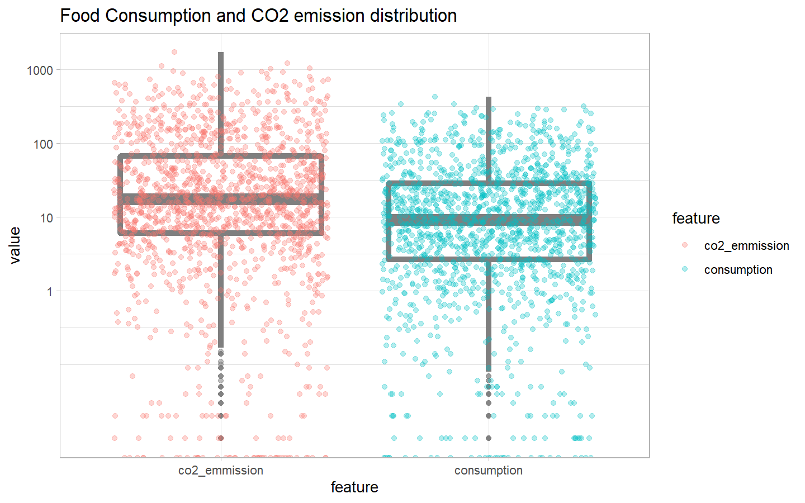
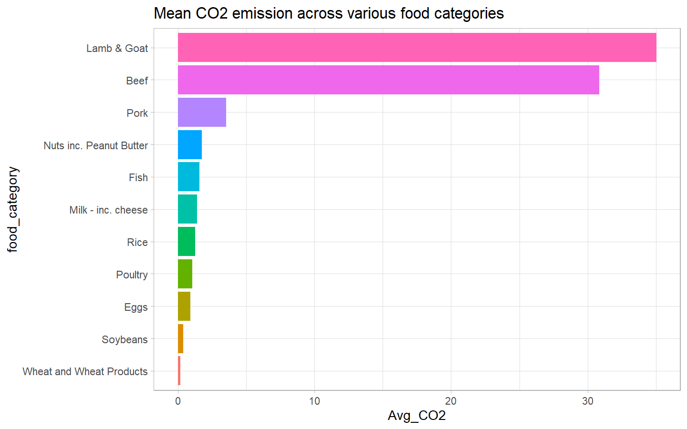
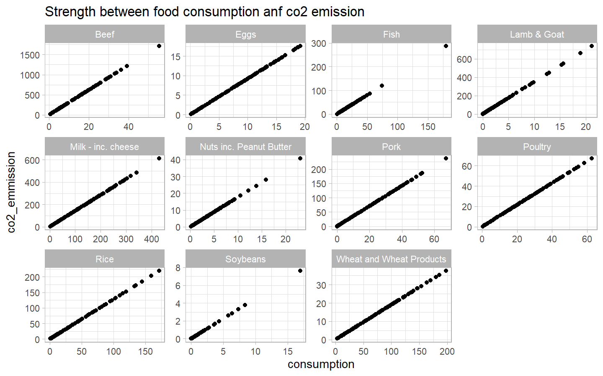
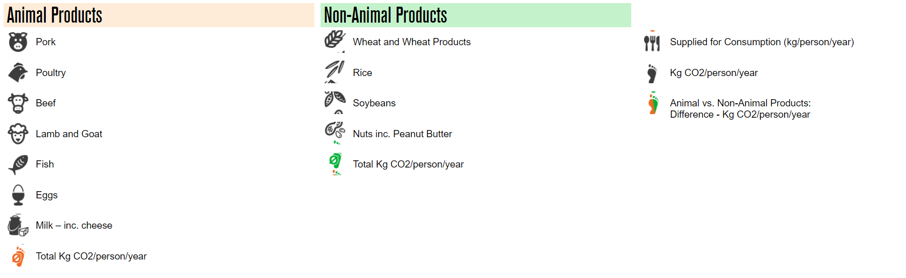
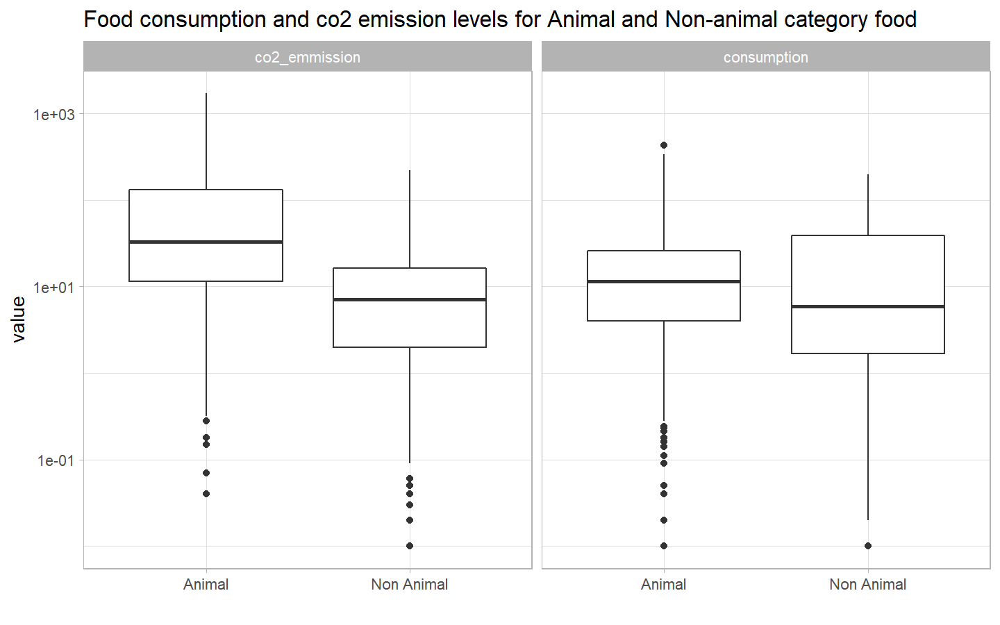
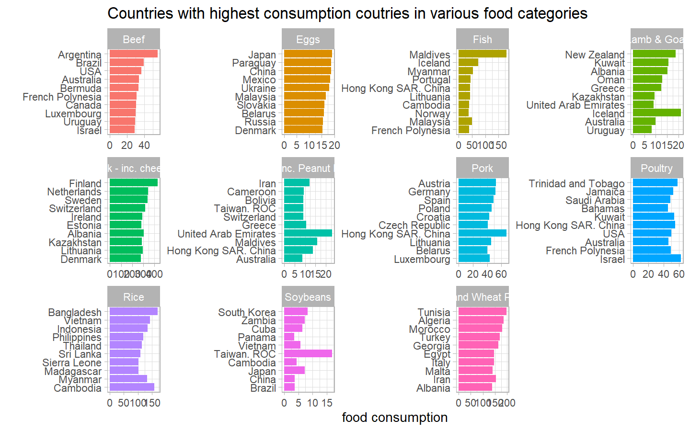
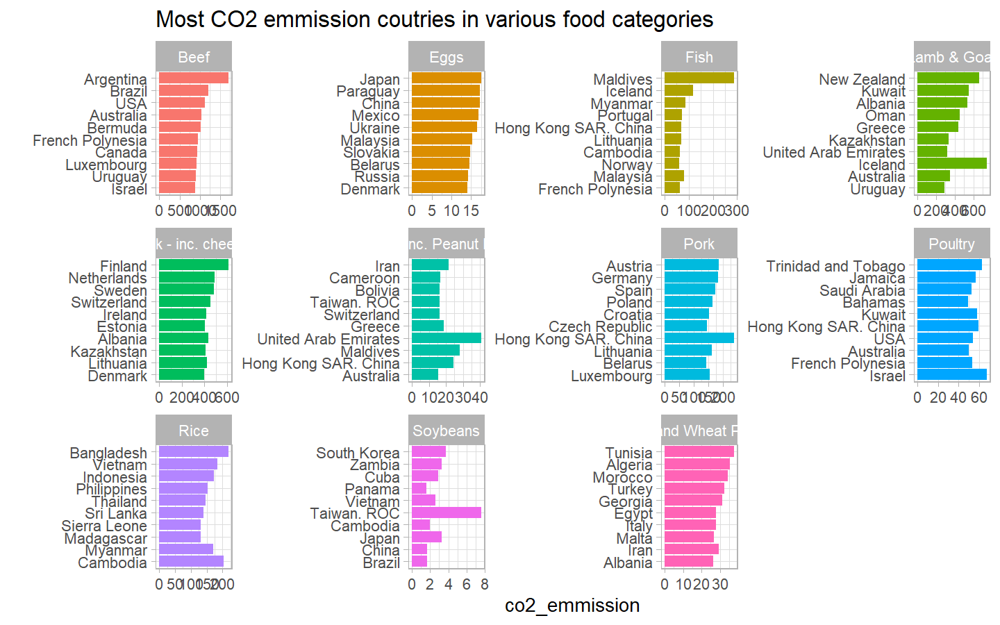
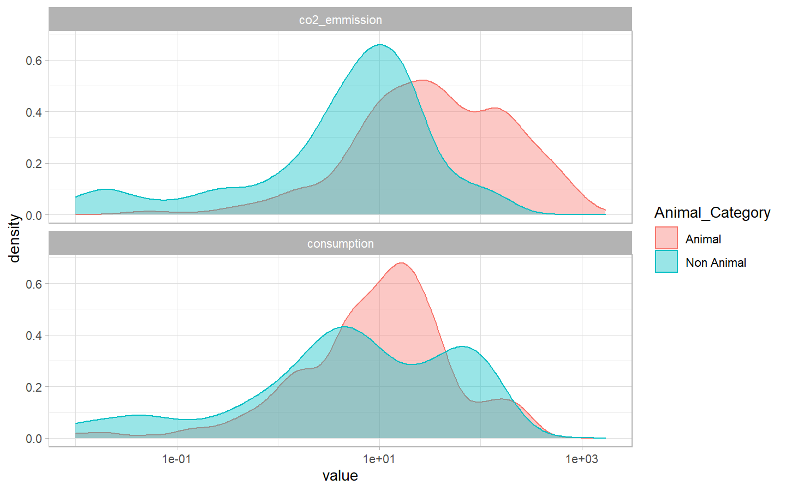

NOTE: For this week’s Tidy Tuesday I followed [Andrew
Couch](https://www.youtube.com/user/asianlongboarder) for data
exploration using tidyverse framework better. This post is inspired from
what I learned from him. You can find a screencast of his vidoe
[here](https://www.youtube.com/watch?v=VKCPYet9qLM&list=PLJfshcspBCYeJeO8YFT5e5HxuYOb5a_1W&index=28&t=0s)

This week’s tidy tuesday dataset is based on food consumption and co2
emissions across the world for various countries. The study, this data
comes from, looks into the food industry’s carbon footprint, directly
comparing different diets in terms of carbon dioxide emissions. The
research, which reveals the annual CO2 emissions per person for 130
nations worldwide, shows which countries could significantly reduce
their carbon footprint by switching to a plant-based diet, as well as
which food types generate the highest carbon dioxide emissions.

### Load the weekly Data

To dowload the weekly data, R has a useful tdutuesdayR package which
gives handy and easy to use functions. We will use tt\_load function and
load the data in the `tt` object.

``` r
tt <- tt_load("2020-02-18")
```

    ## 
    ##  Downloading file 1 of 1: `food_consumption.csv`

### Load the files provided in the dataset

There is only one file provided in this week’s dataset. We will load the
original file as raw file and will keep it intact. We will create
another copy of it for further purposes.

``` r
food_consumption_raw <- tt$food_consumption
food_consumption <- food_consumption_raw
food_consumption %>% 
  head(20) %>% 
  knitr::kable()
```

| country   | food\_category           | consumption | co2\_emmission |
| :-------- | :----------------------- | ----------: | -------------: |
| Argentina | Pork                     |       10.51 |          37.20 |
| Argentina | Poultry                  |       38.66 |          41.53 |
| Argentina | Beef                     |       55.48 |        1712.00 |
| Argentina | Lamb & Goat              |        1.56 |          54.63 |
| Argentina | Fish                     |        4.36 |           6.96 |
| Argentina | Eggs                     |       11.39 |          10.46 |
| Argentina | Milk - inc. cheese       |      195.08 |         277.87 |
| Argentina | Wheat and Wheat Products |      103.11 |          19.66 |
| Argentina | Rice                     |        8.77 |          11.22 |
| Argentina | Soybeans                 |        0.00 |           0.00 |
| Argentina | Nuts inc. Peanut Butter  |        0.49 |           0.87 |
| Australia | Pork                     |       24.14 |          85.44 |
| Australia | Poultry                  |       46.12 |          49.54 |
| Australia | Beef                     |       33.86 |        1044.85 |
| Australia | Lamb & Goat              |        9.87 |         345.65 |
| Australia | Fish                     |       17.69 |          28.25 |
| Australia | Eggs                     |        8.51 |           7.82 |
| Australia | Milk - inc. cheese       |      234.49 |         334.01 |
| Australia | Wheat and Wheat Products |       70.46 |          13.44 |
| Australia | Rice                     |       11.03 |          14.12 |

As we can see, data looks clean and properly arranged. There are 4
columns. Various countries and food categories have been listed.
consumption and co2 emission KG/per person/per year has been provided.

### Tidying data

It is a good practice to tidy the data. Here the intent is to transform
the file in that form which we are going to use the most. It prevents
redundancy of steps and saves time.

``` r
food_consumption_tidy <- food_consumption_raw %>% 
    pivot_longer(3:4, names_to = "feature", values_to = "value")

food_consumption_tidy %>% 
  head(5) %>% 
  knitr::kable()
```

| country   | food\_category | feature        | value |
| :-------- | :------------- | :------------- | ----: |
| Argentina | Pork           | consumption    | 10.51 |
| Argentina | Pork           | co2\_emmission | 37.20 |
| Argentina | Poultry        | consumption    | 38.66 |
| Argentina | Poultry        | co2\_emmission | 41.53 |
| Argentina | Beef           | consumption    | 55.48 |

### Visualize the Data

The most natural way to move ahead with data exploration is to try
visualizing the data. Check for most common patterns that you see in the
data and try to form some hypothesis.

First of all, we will try to see how consumption and co2 emission are
distributed using a boxplot.

``` r
food_consumption_tidy %>% 
    ggplot(aes(feature, value)) +
    geom_boxplot(size = 2, alpha = 0.5, color = "gray50") +
    geom_jitter(aes(color = feature), alpha = 0.3) +
    scale_y_log10(breaks = c(1, 10, 100, 1000)) +
    labs(title = "Food Consumption and CO2 emission distribution")
```

<!-- -->

Box-plot shows that co2 emissions and food consumption patterns vary
drastically among countries. The highest consumption countries have 1000
times higher consumption than the least consumption countries. Although
they are not many.

Mean CO2 emission across various food categories

``` r
food_consumption %>% 
    mutate(co2perfood = co2_emmission / consumption) %>% 
    group_by(food_category) %>% 
    summarise(Avg_CO2 = mean(co2perfood, na.rm = T)) %>% 
    mutate(food_category = fct_reorder(food_category, Avg_CO2)) %>% 
    ggplot(aes(Avg_CO2, food_category)) +
    geom_col(aes(fill = food_category), show.legend = F) +
    labs(title = "Mean CO2 emission across various food categories")
```

<!-- -->

Clearly, Lamb & Goat and Beef have extremely high carbon emission and
must be discouraged eating. Although high carbon emission indicates that
food consumption is quite high in these two categories across the world.

Lets see, how carbon emission changes with respect to food consumption
in various food categories

``` r
food_consumption %>% 
    ggplot(aes(consumption, co2_emmission)) +
    geom_point() +
    facet_wrap(~food_category, scales = "free")+
    labs(title = "Strength between food consumption anf co2 emission")
```

<!-- --> This shows
that there is a linear relationship between food consumption and co2
emission. It strongly suggests that there is a mathematical relationship
to calculate the carbon emission level when food consumption is known.

Lets create another column which can help us in categorizing the dataset
in Animal and Non-Animal Categories of food. Following image shows
details about the food categories that have been used in this study.

<!-- -->

``` r
food_consumption <- food_consumption %>% 
    mutate(Animal_Category = if_else(food_category %in% c("Beef", "Pork", "Poultry", "Lamb & Goat", "Fish", "Eggs", "Milk - inc. cheese"), "Animal", "Non Animal"))

food_consumption %>% head() %>% knitr::kable()
```

| country   | food\_category | consumption | co2\_emmission | Animal\_Category |
| :-------- | :------------- | ----------: | -------------: | :--------------- |
| Argentina | Pork           |       10.51 |          37.20 | Animal           |
| Argentina | Poultry        |       38.66 |          41.53 | Animal           |
| Argentina | Beef           |       55.48 |        1712.00 | Animal           |
| Argentina | Lamb & Goat    |        1.56 |          54.63 | Animal           |
| Argentina | Fish           |        4.36 |           6.96 | Animal           |
| Argentina | Eggs           |       11.39 |          10.46 | Animal           |

Now, we will use these newly formed categories. We will try to see if
there exists a significant difference in food consumption and co2
emission for Animal and Non-Animal category food.

``` r
food_consumption %>% 
    select(Animal_Category, consumption, co2_emmission) %>%
    pivot_longer(2:3, names_to = "feature", values_to = "value") %>% 
    ggplot(aes(Animal_Category, value)) +
    geom_boxplot() +
    scale_y_log10() +
    facet_wrap(~feature)+
    labs(title = "Food consumption and co2 emission levels for Animal and Non-animal category food",
         x = "")
```

<!-- -->

Seeing the above visualization, we can form a hypothesis that there is a
significant difference in mean co2 emission levels between Animal and
Non-animal categories. We can confirm this hypothesis by running a
simple two sample t-test.

### Lets run a t-test

``` r
food_consumption %>% 
    select(Animal_Category, consumption, co2_emmission) %>%
    pivot_longer(2:3, names_to = "feature", values_to = "value") %>%
    filter(feature == "consumption") %>% 
    t.test(value~Animal_Category, data = .)
```

    ## 
    ##  Welch Two Sample t-test
    ## 
    ## data:  value by Animal_Category
    ## t = 1.012, df = 1333.9, p-value = 0.3117
    ## alternative hypothesis: true difference in means is not equal to 0
    ## 95 percent confidence interval:
    ##  -2.403472  7.525670
    ## sample estimates:
    ##     mean in group Animal mean in group Non Animal 
    ##                 29.04171                 26.48062

``` r
food_consumption %>% 
    select(Animal_Category, consumption, co2_emmission) %>%
    pivot_longer(2:3, names_to = "feature", values_to = "value") %>%
    filter(feature == "co2_emmission") %>% 
    t.test(value~Animal_Category, data = ., alternative = "greater")
```

    ## 
    ##  Welch Two Sample t-test
    ## 
    ## data:  value by Animal_Category
    ## t = 15.312, df = 984.39, p-value < 2.2e-16
    ## alternative hypothesis: true difference in means is greater than 0
    ## 95 percent confidence interval:
    ##  83.65299      Inf
    ## sample estimates:
    ##     mean in group Animal mean in group Non Animal 
    ##                 108.4682                  14.7366

### A more tidy approach to run the same two sample t-test

``` r
food_consumption %>% 
    select(Animal_Category, consumption, co2_emmission) %>%
    pivot_longer(2:3, names_to = "feature", values_to = "value") %>%
    nest(valdata = c("Animal_Category", "value")) %>% 
    mutate(t_test = map(valdata,
                        ~t.test(value~Animal_Category, data = .)),
           results = map(t_test, tidy)) %>% 
    unnest(results)
```

    ## # A tibble: 2 x 13
    ##   feature valdata t_test estimate estimate1 estimate2 statistic  p.value
    ##   <chr>   <list>  <list>    <dbl>     <dbl>     <dbl>     <dbl>    <dbl>
    ## 1 consum~ <tibbl~ <htes~     2.56      29.0      26.5      1.01 3.12e- 1
    ## 2 co2_em~ <tibbl~ <htes~    93.7      108.       14.7     15.3  1.25e-47
    ## # ... with 5 more variables: parameter <dbl>, conf.low <dbl>, conf.high <dbl>,
    ## #   method <chr>, alternative <chr>

Test results show that the difference in mean co2 emission for Animal
and NOn-animal categories is significant. It confirms our hypothesis and
strengthens the fact that vegetarian food should be promoted to bring
the global carbon emission levels down.

### Countries with highest consumption coutries in various food categories

``` r
food_consumption %>%
    group_by(food_category) %>% 
    slice_max(consumption, n = 10) %>% 
    mutate(country = fct_reorder(country, consumption)) %>% 
    ungroup() %>%
    ggplot(aes(consumption, country)) +
    geom_col(aes(fill = food_category), show.legend = F) +
    facet_wrap(~food_category, scales = "free") +
      labs(title = "Countries with highest consumption coutries in various food categories",
         x = "food consumption",
         y = "")
```

<!-- -->

### Most CO2 emmission coutries in various food categories

On the similar lines, we can see which countries have highest co2
emissions in various food categories.

``` r
food_consumption %>%
    group_by(food_category) %>% 
    slice_max(co2_emmission, n = 10) %>% 
    mutate(country = fct_reorder(country, co2_emmission)) %>% 
    ungroup() %>%
    ggplot(aes(co2_emmission, country)) +
    geom_col(aes(fill = food_category), show.legend = F) +
    facet_wrap(~food_category, scales = "free") +
    labs(title = "Most CO2 emmission coutries in various food categories",
         y = "")
```

<!-- --> Nothing
strange here, As there is a linear relationship between food consumption
and co2 emissions, hence same countries appear here also on top.

Finally, we would like to see animal and non-animal category wise
distribution of both food consumption and co2 emission.

``` r
food_consumption %>% 
    select(Animal_Category, consumption, co2_emmission) %>%
    pivot_longer(2:3, names_to = "feature", values_to = "value") %>%
    ggplot(aes(value, fill = Animal_Category, color = Animal_Category)) +
    geom_density(alpha = 0.4) +
    scale_x_log10() +
    facet_wrap(~feature, nrow = 2)
```

<!-- -->

Okay..\! We did it..\!\!\! In this post, we saw how we can use different
data exploration techniques to understand our data better. We also saw
how simple two sample t-test can be used to confirm a hypothesis. We saw
a neat and tidy approach to run multiple statistical test simultaneously
on many tibbles.

I hope this helps. Thank you so much for reading. See you again in the
next post..\!\!
